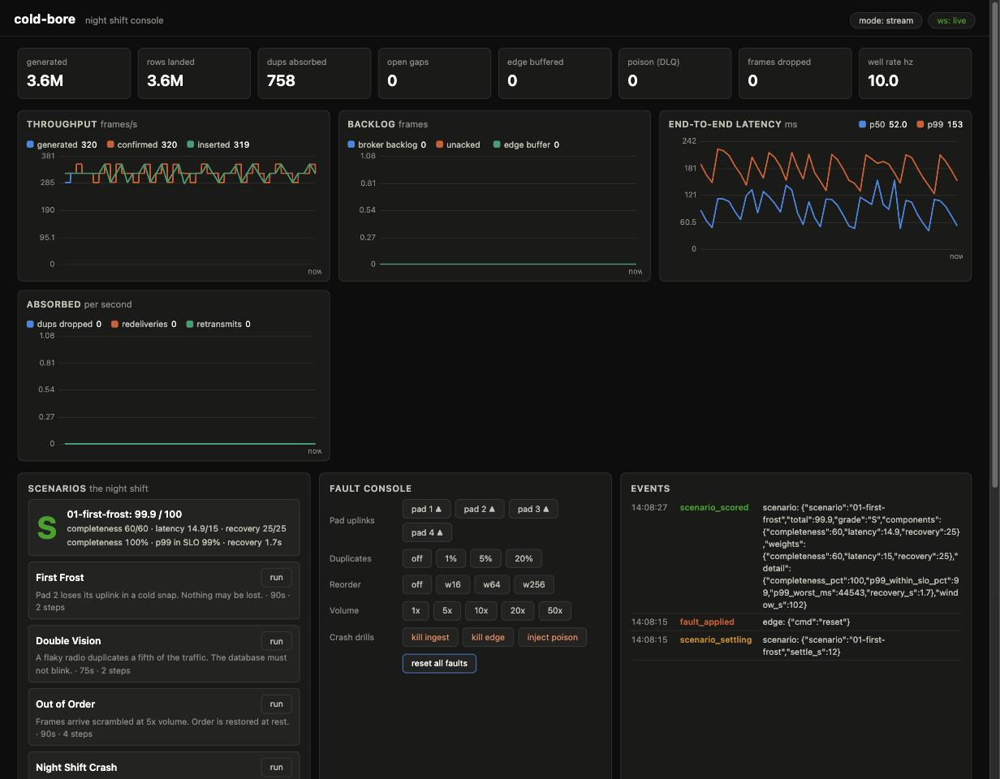

# cold-bore

**A frac-pad telemetry pipeline you can break on purpose.**

cold-bore is an interactive, fault-injectable scale model of a real-time
completions-style data platform:

```
field (simulated pads) → edge store-and-forward → RabbitMQ → Rust ingest → TimescaleDB → FastAPI/WebSocket → dashboard
```

Synthetic frac-pad sensors (pump pressure, slurry rate, proppant
concentration, wellhead temperature) stream sub-second telemetry through a
real distributed pipeline. The dashboard is a game console: you are the
night-shift infrastructure engineer. Sever a pad's uplink, inject
duplicates, scramble message order, kill the consumer mid-batch, 100x the
volume, and watch the system degrade, recover, and account for every frame.



## What it demonstrates, with numbers

The pipeline is **at-least-once end to end, effectively exactly-once at the
sink** (idempotent batched inserts keyed on `(pad, well, epoch, seq)`), and
every claim is a measured, reproducible result
([docs/benchmarks/](docs/benchmarks/)):

- **16,000 frames/s sustained end to end** on classic queues; the ceiling
  (~20.7k f/s) is the producer's per-message confirm path, not the broker
  or the database.
- **The RabbitMQ Streams migration lifts that ceiling**: the same workload
  sustains the full **32,000 f/s at p99 35 ms** where classic saturated
  with 15-second latencies: measured A/B, same machine, same drills.
- **Replay as a first-class operation**: `TRUNCATE` the database, restart
  the consumer, and **3.42M rows re-materialize from the stream in 68 s**
  (50k rows/s), handing off seamlessly to the live tail.
- **Every failure drill ends with zero missing frames**: link loss
  (store-and-forward custody math exact to the frame), 20% duplicate
  injection (absorbed at the sink, and at the broker by the dedup
  producer in stream mode), reordering (gaps open, heal, and close),
  consumer/producer crashes (supervised restart; transactional offsets
  make stream-mode resume exact, with zero re-read).

The migration was executed the way a live system would do it: dual-bind the
stream alongside the classic queue (zero producer change), move the
consumer to offset tracking (offset committed in the same transaction as
its data), then move the producer to the native protocol. Each step
shipped, gated, and measured separately.

## The game

Five scenarios under [`scenarios/`](scenarios/) turn the failure drills
into scored shifts: **First Frost** (uplink loss), **Double Vision**
(duplicate storm), **Out of Order** (scrambled at 5x), **Night Shift
Crash** (consumer death under load), **Perfect Storm** (all of it at 10x).
The engine fires the timeline, clears the faults, lets the pipeline
settle, and grades the shift (S to F) purely from SQL over what actually
landed: completeness from seq spans, latency from metric snapshots,
recovery time from the fault record. A flattering score would require the
accounting to lie.

## Run it

```sh
docker compose -f infra/docker-compose.yml up -d   # RabbitMQ 4 + TimescaleDB
./scripts/run-edge.sh                              # pad simulator (supervised)
./scripts/run-ingest.sh                            # consumer/sink (supervised)
./scripts/run-api.sh                               # FastAPI + dashboard
open http://localhost:8000                         # the night-shift console
```

`CB_MODE=stream` on the edge and ingest switches the data plane to RabbitMQ
Streams. All knobs are `CB_*` env vars (see `crates/coldbore-proto/src/config.rs`).

## Stack and governance

Rust (edge + ingest hot path: lapin, rabbitmq-stream-client,
tokio-postgres, hdrhistogram) · Python (FastAPI, aio-pika, asyncpg) ·
RabbitMQ 4.1 (classic queues + streams) · TimescaleDB (hypertables,
continuous aggregates, compression) · a zero-dependency canvas dashboard.

The repo governs itself with [spec-spine](https://github.com/statecrafting/spec-spine):
every component is owned by a spec under [`specs/`](specs/), CI recompiles
the authority ledger and **refuses code that drifts from its owning spec**
(the coupling gate has already caught two real drifts in this repo's
history, and was right both times). Start with
[`docs/design/architecture.md`](docs/design/architecture.md): the
delivery contract hop by hop, the failure drill matrix, and the decision
log.

## Not affiliated

This project models the *architecture shape* of real-time completions
platforms. All data is synthetic; it is not affiliated with and contains
nothing from any real product.
